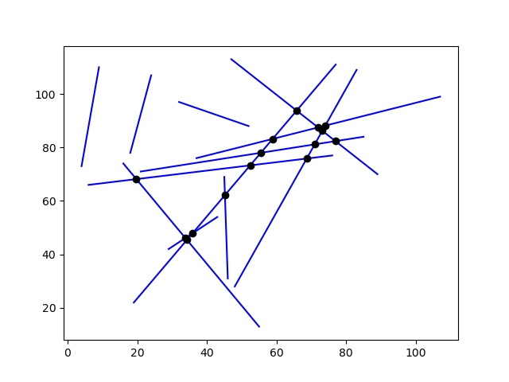
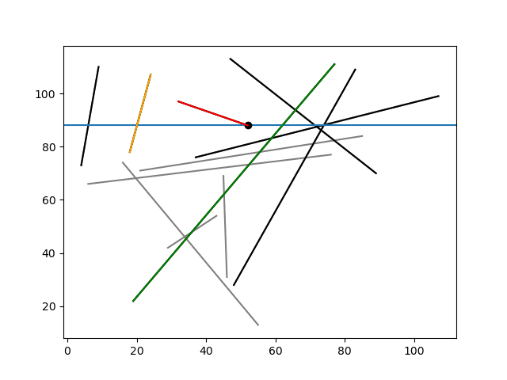
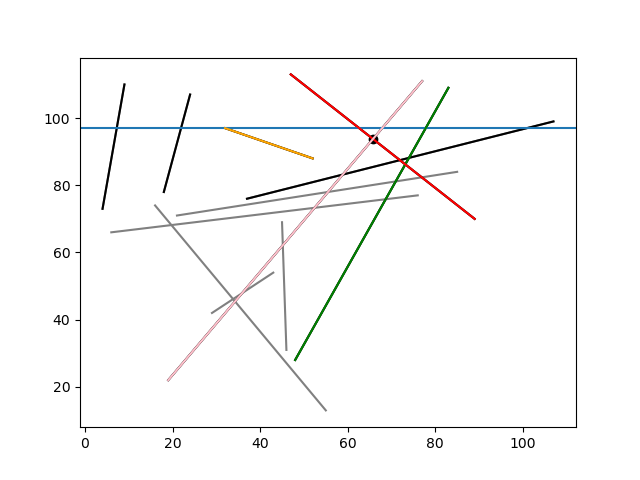
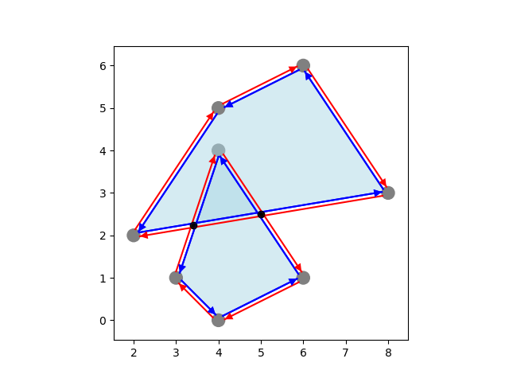
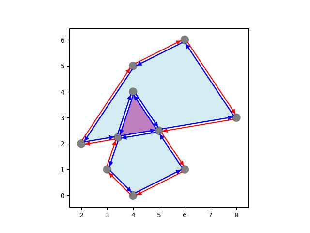
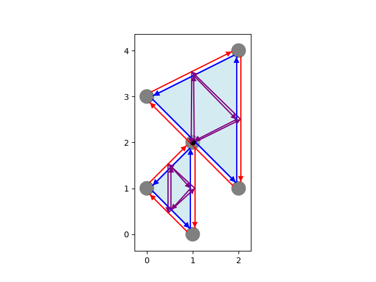
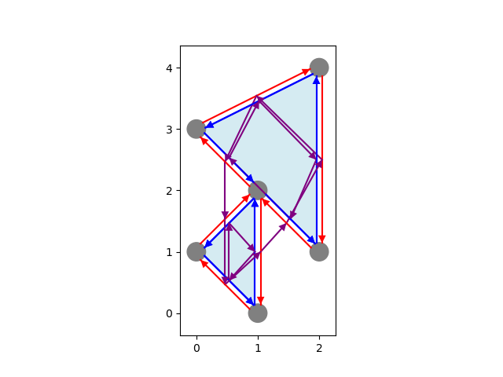
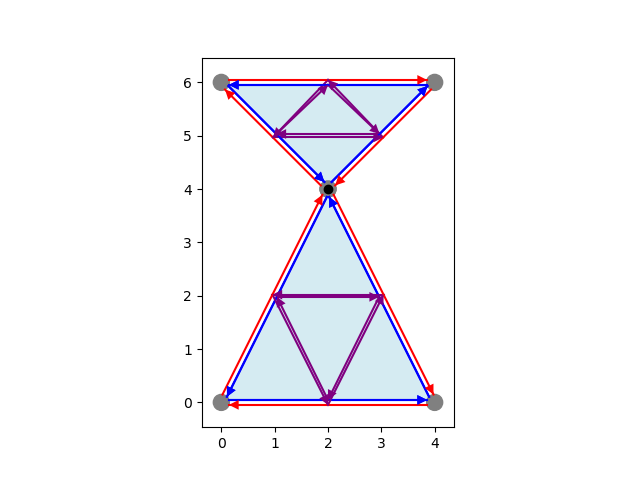
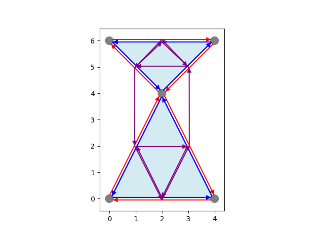

# Project 3: Map Overlay

This is the third project for CS 290: Computational Geometry at Duke University, fall 2024.

## Change Log
- no changes yet

## Table of Contents

- [Project 3: Map Overlay](#project-3-map-overlay)
  - [Change Log](#change-log)
  - [Table of Contents](#table-of-contents)
  - [Important Dates](#important-dates)
  - [Goals](#goals)
  - [Organization](#organization)
    - [Common Files](#common-files)
    - [Task 1: Segment Intersection](#task-1-segment-intersection)
      - [Helper Files (no TODOs)](#helper-files-no-todos)
      - [Files to Complete (TODOs)](#files-to-complete-todos)
    - [Task 2: Map Overlay](#task-2-map-overlay)
      - [Helper Files (no TODOs)](#helper-files-no-todos-1)
      - [Files to Complete (TODOs)](#files-to-complete-todos-1)
    - [Other Files](#other-files)
  - [Figures](#figures)
    - [Task 1: Segment Intersections](#task-1-segment-intersections)
    - [Task 2: Map Overlay](#task-2-map-overlay-1)
  - [Submitting to Gradescope](#submitting-to-gradescope)
  - [Task 1: Segment Intersection (40%)](#task-1-segment-intersection-40)
    - [Part A: Fast Neighbor Search](#part-a-fast-neighbor-search)
    - [Part B: Sweep-Line Event Handling](#part-b-sweep-line-event-handling)
    - [Testing](#testing)
  - [Task 2: Map Overlay Event-Handling (30%)](#task-2-map-overlay-event-handling-30)
    - [Testing](#testing-1)
  - [Task 3: Analysis (30%)](#task-3-analysis-30)


## Important Dates
- Sunday 10/20: Project released
- Wednesday 10/23: *Limited* Autograder on Gradescope
- Sunday 10/27 @ 11:59pm: Progress report **due** (make a private post on Ed with subject "Check-In")
- Sunday 11/3 @ 11:59pm: Project **due**

## Goals
For this project you will implement key subroutines for an $O((n+k) \log n)$-time segment intersection algorithm and an algorithm to compute the overlay of two planar subdivisions, represented as doubly-connected edge lists (DCELs).

**Start early!** By the nature of the algorithms, this project involves more classes/files than those before it.

<!-- ## System Requirements

We use Python 3.12, though as early as 3.9 should work for any packages we may use in the course, including this project. We recommend installing the [latest Python version](https://www.python.org/downloads/) from python.org or the [latest Anaconda distribution](https://www.anaconda.com/download/success), which is a free installation of Python with many useful packages, including ones that will use in the course. Please let Alex know if you have any technical issues setting up your Python environment. As an editor, we recommend Visual Studio Code with the Python extensions. See [here](https://code.visualstudio.com/docs/python/python-tutorial) for more info. You are free to use any other editor/IDE, of course.

For this project, we only depend on the `matplotlib` package. If you are using the Anaconda distribution of Python, then you already have it. If not, you can install it using the `pip` command:

`pip install matplotlib`

Depending on how your Python installation is set up on your system, you may need to ensure that `pip` has been installed and is on your PATH.

The full documentation for the `matplotlib` package can be read [here](https://matplotlib.org/stable/users/index.html), which has a large number of examples. StackOverflow is also an excellent resource for uses of this package.

## Object-Oriented Python
The project heavily uses (basic) object-oriented principles (OOP) to organize the flow of logic. For one of many excellent resources for learning about Python's OOP design, we recommend the [official Python tutorial](https://docs.python.org/3/tutorial/classes.html), but there are many others. -->

## Organization
This repository includes all necessary skeleton files, as well as some example snippets that may be useful for testing your code and/or implementing the following tasks. In particular, we have provided some code for basic uses of `matplotlib` that you may use as starting points for your own visualization code. We break up the project into two main tasks: Segment Intersection and Map Overlay. Both use the `primitives.py` file and the classes defined therein.

### Common Files

- `primitives.py`: Contains `Point`, `Segment`, and `Line` classes, representing planar objects and supporting arbitrary-precision arithmetic **if they have rational coordinates**. (Our test cases all have rational coordinates.) All classes provide a `.draw()` method for visualization purposes.

### Task 1: Segment Intersection

#### Helper Files (no TODOs)

- `event_queue.py`: Contains the `EventKind` enum and `Event` and `EventQueue` classes. The `EventQueue` is a priority queue for segment-intersection sweep-line events, represented as `Event` objects. Each `Event` is represented by three items: one of three kinds, `EventKind.INSERT`, `EventKind.INSERT` or `EventKind.INTER`, the 2D `Point` at which the event occurs, and a tuple of 1 or 2 `Segment`s involved with the event. (NOTE: A general solution would allow for 3 or more segments to be involved with a single event, which we do not consider for this project.)

- `sweep_line_comparator`: A custom comparator class `SweepLineComparator` for use by the provided AVL tree (in `avl.py`), that maintains the position of a horizontal sweep-line to order intersected segments by their points of intersection with the sweep-line.

- `sweep_line_datasets.py`: Three methods to generate sets of $n$ segments for a parameter $n$. Note that `generate_random_segments()` is not guaranteed to provide a valid dataset for the expected implementation of the sweep-line algorithm, as three or more segments may (with very low probability) intersect at a common point, in which case try a different `random.seed()` (or rerun without a seed).

#### Files to Complete (TODOs)

- `avl.py`: A full-fledged dynamic balanced binary tree class, `AVLTree` with node class `AVLNode`, that allows insertions (with `.insert()`) and deletions (with `.delete()`). Supports custom comparators, by default comparing two objects with built-in comparison `<`, and guarantees a height of $O(\log n)$ where $n$ is the number of items stored. **TODO**: Implement the `left_neighbor()` and `right_neighbor()` methods to return, for a given item stored in the tree, the one left and right of it, respectively, in sorted order (if any). See Task 1A.

- `sweep_line.py`: A class `SweepLine` used to compute segment intersections via sweep-line. Implemented as a subclass of `AVLTree` to store segments intersected by the sweep-line, which uses a `SweepLineComparator` for comparisons. Maintains the sweep-line events in an `EventQueue`. See the completed method `find_intersections()`. **TODO**: Implement the three event-handling methods `handle_insert`, `handle_delete`, and `handle_intersection`. See Task 1B.
  - NOTE: The class includes helpful visualizations that can be enabled by setting the attribute `DRAW=True` at the top of the class. The provided code will display a figure after handling each individual event to view the process step-by-step. Feel free to edit this code as you find helpful.

### Task 2: Map Overlay

#### Helper Files (no TODOs)

- `dcel.py`: Contains the `DCEL` class using objects in `dcel_helpers.py`, a representation of planar subdivisions. Provides a `.draw()` method for visualization purposes. The main method is `overlay()` which returns a `DCEL` that is the overlay of two given `DCEL` objects. By default, its `Face` records are not computed, as the provided subroutine to compute them requires all `Halfedge` and `Edge` records of the overlay `DCEL` to be correct. To enable `Face` computations, call this method with `compute_faces=True`.
  - NOTE: We also include the `verify()` method, which may be useful when debugging your code. Feel free to edit it as you find useful.

- `dcel_helpers.py`: Contains `Edge`, `Halfedge`, `Vertex`, `Face`, and `BoundaryCycle` object classes for the `DCEL` class. `Edge` extends the `Segment` class, and `Vertex` extends the `Point` class. All classes provide a `.draw()` method for visualization purposes.

- `dcel_datasets.py`: Contains many methods to construct pairs of DCELs for testing your implementation of handling each type of event.

#### Files to Complete (TODOs)

- `overlay_cases.py`: Contains a method to handle each of the three event types, `vertex_vertex()`, `vertex_edge()`, and `edge_edge()`. **TODO**: The first has been implemented for you, whose code may be helpful for implementing the other two. See Task 2.

### Other Files

- The `./figs/` folder contains the figures seen in this document using the Python `matplotlib` package. The full documentation for `matplotlib` can be found [here](https://matplotlib.org/stable/users/index.html).

## Figures

### Task 1: Segment Intersections



All intersections for $n=12$ segments, generated with `generate_random_segments(12)`.



A deletion event: The segment being deleted is red, the left neighbor to the event point is orange, and the right neighbor to the event point is green.



An intersection event: The intersecting segments are red/pink. The left neighbor to the intersection is orange, and the right neighbor to the intersection is green.

### Task 2: Map Overlay




The before/after of overlaying the DCELs from `edge_edge_test()` in `dcel_datasets.py`. Halfedges are red on inner cycles, and blue on outer cycles. In the overlay, the purple face is contained in a bounding face of each of the original DCELs.




The before/after of overlaying the DCELs from `vert_edge_test()` in `dcel_datasets.py`. Halfedges are red on inner cycles, and blue on outer cycles. Halfedges are red on inner cycles, and blue on outer cycles. In the overlay, the purple face is contained in a bounding face of each of the original DCELs. Note the `Halfedge`s on the (single) inner cycle of the bounded face in the overlay, which have been updated accordingly.




The before/after of overlaying the DCELs from `vert_vert_test()` in `dcel_datasets.py`. The purple arrows point from `Halfedge`s to their previous on the same face. In the overlay, the purple face is contained in a bounding face of each of the original DCELs. Note the `Halfedge`s on the (single) inner cycle of the bounded face in the overlay, which have been updated accordingly.

## Submitting to Gradescope
For this Project we will have two "assignments" on Gradescope: one for all project code, and one to upload your PDF (see Task 3 - Analysis). You should upload **three** files to the Code portion:

- `avl.py` (Task 1)
- `sweep_line.py` (Task 1)
- `overlay_cases.py` (Task 2)

## Task 1: Segment Intersection (40%)

For this task, implement a $O((n+k)\log n)$-time algorithm to compute all $k$ intersection points of a given set of $n$ segments.

### Part A: Fast Neighbor Search

This part concerns only `avl.py`. See the bottom of this file to see how to use the `AVLTree` class to store comparable objects, e.g., `int`s.

For this part, implement `left_neighbor()` and `right_neighbor()` methods of the `AVLTree` class so that they run in $O(h)$ time, where $h$ is the height of the tree (which will be $O(\log n)$ if it contains $n$ items/nodes as it is a self-balancing tree). These methods should return the items immediately left/before and immediately right/after in sorted order of the items in the tree. For example, if the tree contains `int`s `1,4,6,10` then `left_neighbor(6) == 4`, `right_neighbor(6) == 10`, and `right_neighbor(10) == None`.

We have provided naive $O(n)$-time implementations, `naive_left_neighbor()` and `naive_right_neighbor()`, which simply obtain the sorted order of all items in the tree, scan to find the given item, then report those immediately before/after it. Your algorithm cannot afford to do this.

Instead, traverse the tree appropriately via the `left`, `right`, and `parent` attributes of the `AVLNode` objects that represent the tree nodes, and using `self.comparator.compare(a,b)` to compare two items in the tree. Note that this method returns `-1` if `a` is before `b`, `0` if `a==b`, and `1` if `a` is after `b`. Recall the properties of binary search trees to inform your traversal, such as for any node `u`, `u.left` contains only items less than/before the item `u.key` stored at `u`, and `u.right` contains only items greater/after `u.key`.

### Part B: Sweep-Line Event Handling

This part concerns implementing the methods `handle_insert()`, `handle_delete()`, and `handle_intersection` of the `SweepLine` class in `sweep_line.py`. However, this class depends on proper usage of the `Event` and `EventQueue` classes in `event_queue.py` and the `SweepLineComparator` class in `sweep_line_comparator.py`. Some usage of these classes is provided in the main method, `find_intersections()`, which calls each of the event-handling methods for you to implement. **NOTE**: These methods will rely on your neighbor-searching methods from Part A, but they can be worked on out-of-order by using our provided naive implementations in the meantime.

The `SweepLine` class is itself a subclass of the `AVLTree` that uses the `SweepLineComparator` class as its comparator. Thus it has the `.insert()`, `.delete()`, `.left_neighbor()`, `right_neighbor()` methods and all others of that class, which will use this comparator to make any comparisions internally. In particular, the `Segment` objects stored within are ordered by their x-coordinates of intersection with the current position of the sweep-line. See `sweep_line_comparator.py`, namely method `set_last()`.

- `handle_insert()`: An insertion event occurs when the sweep-line reaches the top endpoint of a `Segment seg`, accessed as `seg.top`. The insertion of `seg` should be reflected in the tree by calling the `.insert()` method of the `SweepLine`. This only affects the segments stored in the tree, not the position of the sweep-line itself, which is handled by setting its last position with `self.comparator.set_last()`. Finally, this method should return any new intersection events (specifically, `Event` objects with first parameter `EventKind.INTER`) that are detected between new neighbors on the sweep-line that result from this insertion of `seg`.
  
- `handle_delete()`: A deletion event occurs when the sweep-line reaches the bottom endpoint of a `Segment seg`, accessed as `seg.bottom`. The deletion of `seg` should be reflected in the tree by calling the `.delete()` method of the `SweepLine`. As above, the position of the sweep-line itself must be updated, which is handled by `self.comparator.set_last()`. Because the tree uses the `comparator` to order segments within, it is important to perform the deletion and setting of the sweep-line position in the correct order. Finally, this method should return any new intersection events that are detected between new neighbors on the sweep-line that result from this deletion of `seg`.
  
- `handle_intersection()`: An intersection event occurs when the sweep-line reaches the intersection point of two segments that intersect the sweep-line. This method is called assuming that the portion of `Segment left` above the intersection is left of it, and the portion of `Segment right` above the intersection is right of it. The intersection should be reflected in the tree by calling the provided `.swap()` method of `SweepLine`. As above, the position of the sweep-line itself must be updated by `self.comparator.set_last()`, performed in the correct order with the `.swap()`. Finally, this method should return any new intersection events that are detected between new neighbors on the sweep-line that result from the swaps of `left` and `right`.

### Testing

We have provided some simple methods to generate segments in `sweep_line_datasets.py`. See the bottom of `sweep_line.py` for example usage. Enable plotting of the segments during `find_intersections()` by setting `SweepLine.DRAW=True` at the top of the class, which will draw and display a figure after each event.

## Task 2: Map Overlay Event-Handling (30%)

For this task, implement the event-handling methods to compute the overlay of two planar subdivisions, each represented by the `DCEL` class. These methods are `vertex_edge()` and `edge_edge()` found in `overlay_cases.py`.

We recommend that you first review the `Vertex`, `Edge`, and `Halfedge` classes defined in `dcel_helpers.py`, which you will create and modify in order to reflect the appropriate changes in the given `DCEL`. Then see how the `overlay()` method of `DCEL` is implemented in `dcel.py`. The approach taken is to first merge two copies of the given `DCEL`s to be overlayed into one, which will not be a valid DCEL unless the given ones were disjoint. To modify it into a valid DCEL, we find all pairwise intersections, including at vertices, among the merged set of edges. For each such intersection, we perform a "local" surgery at the point of intersection, which falls into one of three kinds of events:

- `vertex_vertex()`: This method is provided for you, involving two coinciding vertices, one from each of the overlayed DCELs. No new `Edge`s (and thus no `Halfedges`) are created in this case, only the updating of each `Halfedge`'s `.prv` and `.nxt` attributes (to their previous and next `Halfedges` on their incident faces in the merged DCEL).
  
- `edge_edge()`: This method is to be implemented, involving two intersecting edges, one from each of the overlayed DCELs. New `Edge`s and their correspoding `Halfedge`s must be created, their attributes assigned, as well as any relevant existing features (`Vertex`s, `Edge`s, `Halfedge`s) of the DCEL.
  
- `vertex_edge()`: This method is to be implemented, involving a vertex and its incident (non-crossing) edges from one of the overlayed DCELs and a crossing edge from the other. New `Edge`s and their correspoding `Halfedge`s must be created, their attributes assigned, as well as any relevant existing features (`Vertex`s, `Edge`s, `Halfedge`s) of the DCEL.

### Testing

We have provided many example pairs of `DCELs` in `dcel_datasets.py`. See the bottom of `dcel.py` for a short example usage of these methods, which first displays the two DCELs drawn on top of one another and marking all intersection points as black vertices. The next image shown will be the overlay. If the overlay methods above are implemented correctly, no pair of red/blue cycle edges will cross, and calling `overlay()` with `compute_faces=True` will correctly color the faces according to the number of original bounded faces that contain them. The full details are found in the `.draw()` methods of the classes in `dcel_helpers.py`.

## Task 3: Analysis (30%)

1) **Figure/Caption**: Measure the runtimes of `left_neighbor` and `naive_right_neighbor` on `SweepLine`s storing sets of segments with geometrically-increasing sizes, e.g., $n = 100, 1000, \ldots, 10^5$. Specifcally, for each value of $n$, initialize the sweep-line to the $y$-axis and insert each segment constructed via `generate_tall_verticals(n)` as seen below:
````
for i in range(2,6):
    sweep_line = SweepLine()
    sweep_line.comparator.set_last(Point(0,0))
    segs = generate_tall_verticals(10**i)
    for seg in generate_tall_verticals(10**i):
        sweep_line.insert(seg)

    random.shuffle(segs)
    for s in segs[:100]:
        # record time of sweep_line.left_neighbor(seg)
        # record time of sweep_line.naive_left_neighbor(seg)
````

This code initializes one tree `sweep_line` as described above to use in the timing experiment, for `n = 10**i`. For each size `n`, plot the **average time** to answer 100 `left_neighbor()` calls and plot the **average time** to answer 100 `naive_left_neighbor()` calls for randomly sampled inserted `Segment`s. In the caption, compare and contrast their empirical runtimes against the theoretical asymptotic runtimes, $O(n)$ for the naive and $O(\log n)$ for the improved.

2) **Figure/Caption**: This step and the following two involve the runtimes of `find_intersection()` and `naive_seg_inter()` in `sweep_line.py` with varying inputs. Measure the runtimes of these methods on lists of segments with linearly-increasing sizes, e.g., $n = 100, 400, 700, \ldots, 3100$, computed with `generate_tall_segments()`. Plot the runtimes for each size of $n$. In your caption, answer the following: For this input, what is $k$, the number of intersections? How do the empirical runtimes compare to their theoretical, asymptotic runtimes? Justify your answers.

3) Same as the previous, but using `generate_short_segments()`. Plot the runtimes for each size of $n$. In your caption, answer the following: For this input, what is $k$, the number of intersections? How do the empirical runtimes compare to their theoretical, asymptotic runtimes? How and why do these results differ from the previous step? Justify your answers.
   
4) Similar to the previous two, but using `generate_random_segments()`, **and use a smaller range of `n`**, say, $n = 100, 200, 300, \ldots, 1000$, to limit the runtimes. Plot the runtimes and number of intersections, $k$, for each size of $n$. In your caption, answer the following: How do the empirical runtimes compare to their theoretical, asymptotic runtimes? How and why do these results differ from the tall segments in Step 2? Justify your answers.

5) **Figure**: Design two connected planar subdivisions such that their overlay involves at least two of each type of event (vertex-vertex, vertex-edge, edge-edge). Make two figures, one with them drawn separately, and one with their overlay computed, including their colored faces (call `overlay()` with `compute_faces=True`). You may find the the `DCEL.from_points_segs()` method and `Point.from_rationals()` method useful to describe your DCELs without sticking to integer coordinates.